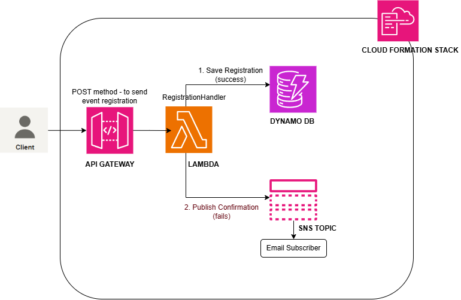
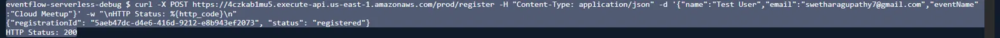
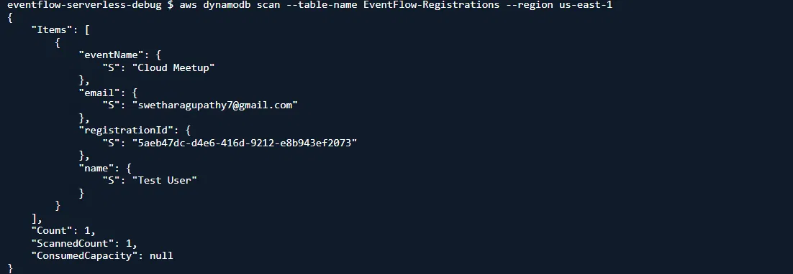
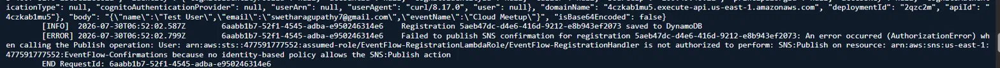
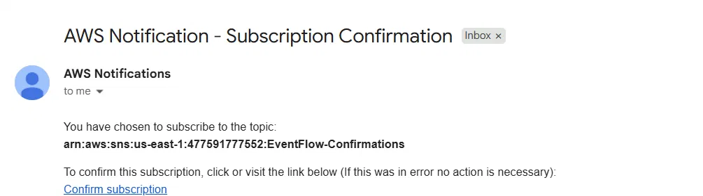
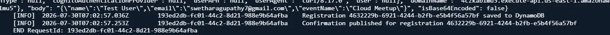

# EventFlow - Debugging a Serverless Pipeline Failure

## Overview
EventFlow is a serverless event-registration pipeline: API Gateway receives
a registration request, a Lambda function saves it to DynamoDB and
publishes a confirmation notification via SNS.

After deploying this stack, registrations were saving successfully but
no confirmation emails were arriving. No errors surfaced to the API
caller, no CloudFormation deployment failure, nothing obviously broken.
This is a writeup of how I diagnosed and fixed a silent partial failure in
a serverless workflow.

## Architecture



The entire stack (API Gateway, Lambda, DynamoDB, SNS) was provisioned via
CloudFormation. CloudWatch Logs captures Lambda execution output — it's
where the root-cause error was actually found (see Investigation below).

**Stack:** AWS Lambda (Python 3.12), API Gateway, DynamoDB, SNS, IAM,
CloudWatch Logs, CloudFormation (IaC)

## The symptom

Sent a test registration request:



Response: `200 OK` with a `registrationId` - looked like a success.


No confirmation email arrived.

## Debugging

### Step 1:  Reproduce and confirm partial success
Checked DynamoDB directly -> the registration **had** saved:



So the data was persisted, but the notification never
arrived. This Confirms API Gateway works and the error must have occured somewhere
downstream.

### Step 2:  Check the logs
Pulled the Lambda's CloudWatch Logs for the request and found the actual
error:



The Lambda had caught this exception and logged it
but still returned `200` to the caller, because the registration itself
had succeeded.

### Step 3:  Trace the permission chain
Checked the Lambda's execution role, `EventFlow-RegistrationLambdaRole`.
Its only attached policy (`EventFlow-DynamoWriteAndLogs`) granted:
- `dynamodb:PutItem` on the registrations table
- `logs:CreateLogGroup` / `CreateLogStream` / `PutLogEvents`

No `sns:Publish` permission existed anywhere on the role - confirmed by
checking the role's attached policy in the IAM console, and CloudWatch error message itself had an authentication error message.

### Root cause
The Lambda execution role granted DynamoDB write and CloudWatch Logs
permissions but not `sns:Publish` on the confirmation topic. The publish
call failed with `AuthorizationError`, which the function caught and
logged the error it did not appear to the caller - so the API returned `200` even
though the notification step failed. The result was a registration
pipeline that appeared fully functional from the outside while
failing to notify the user using email subscription.

## The fix
Applied an inline IAM policy directly to the Lambda's execution
role, granting `sns:Publish` on exactly the confirmation topic's ARN.

```bash
aws iam put-role-policy \
  --role-name EventFlow-RegistrationLambdaRole \
  --policy-name EventFlow-SNSPublishPolicy \
  --policy-document '{
    "Version": "2012-10-17",
    "Statement": [{
      "Effect": "Allow",
      "Action": "sns:Publish",
      "Resource": "arn:aws:sns:us-east-1:<account-id>:EventFlow-Confirmations"
    }]
  }'
```

Re-ran the identical test request. Confirmation email arrived this time:



And CloudWatch confirmed the publish succeeded:



## Tools used
API Gateway, Lambda (Python 3.12), DynamoDB, SNS, IAM, CloudWatch Logs,
CloudFormation, AWS CLI, git/GitHub

## Cleanup
```bash
aws cloudformation delete-stack --stack-name eventflow --region us-east-1
```

